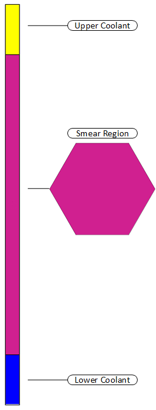
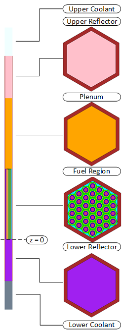
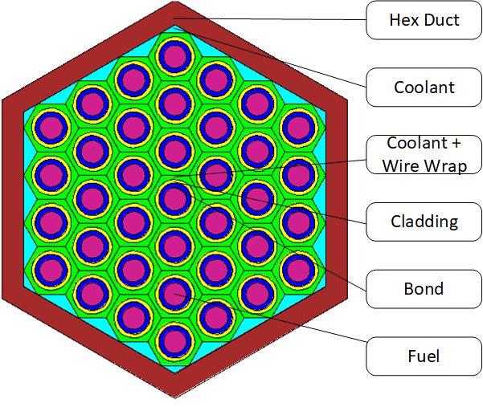

# Assemblies

There are two types of assemblies that can be built in FRIDGe; smear and fuel assemblies.
Both types of assemblies are created using YAML files and can be found in `fridge/data/assembly`.

## Smear Assemblies

Smear assemblies are used to create an single-region homogenous assembly.
This type of assembly is ideal for creating pure coolant assemblies, reflectors, or neutron shields.
The variables for creating a smear assembly can be seen in Table 1.

Table 1. Variables for Smear Assembly YAML file.

|Variable Name   | Variable Type | Unit | Example|
|----------------|---------------|------|--------|
|Assembly Type  | string | -- | Smear|
|Assembly Pitch | float  | cm | 12.0|
|Duct Thickness | float | cm | 0.3|
|Duct Inside Flat to Flat | float | cm | 11.1|
|Assembly Height | float | cm | 240|
|Coolant* | string | -- | LiquidNa|
|Assembly Material | string | -- | HT9|
|Blank Height | float | cm | 220|
|Blank Smear | Dictionary | str: wt % | {LiquidNa: 0.9, HT9: 0.1}|
|Z Position | float | cm | -60|

* Optional if building full core model.

`Assembly Type` is a string used to denote the types of assembly (Smear or Fuel).
`Assembly Pitch` is a float to denote the distance from the center of one assembly to an adjacent assembly.
Note: All assemblies in a core should have the same assembly pitch; if they don't errors in geometry may arise.
`Duct Thickness` is a float to denote the thickness of the assembly duct.
`Duct Inside Flat to Flat` is a float to denote the distance from one flat edge of the inner hexagon to the other.
`Assembly Height` is a float used to denote the total height of the assembly.
`Coolant` is a string used to create a material for the coolant.
`Assembly Material` is a string used to create a material for the assembly.
`Blank Height` is a float used to denote the height of the smear portion of the assembly.
Note: If the `Blank Height` is less than the `Assembly Height`, the excess height will be used to create two coolant regions above and below the smear region.
Note: If `Blank Height` of the assembly exceeds the `Assembly Height`, the `Assembly Height` will truncate the `Blank Height`, this may lead to geometry errors.
`Blank Smnear` is a dictionary of strings and weight percents.
This will create a smeared material where each string in the dictionary will create a material, whose weight fraction is the corresponding float.
`Z Position` is a float which allows the user to manually adjust where they want the bottom of the smear assembly to be.

Figure 1 shows the layout of the blank assembly.

Figure 1. FRIDGe created smear assembly.

## Fuel Assembly

Fuel assemblies are used to create assemblies with a heterogeneous fuel region.
This is idea for creating driver, blanket and limited experimental assemblies.
The variables for creating a fuel assembly can be seen in Table 2.

Table 2. Variables for Fuel Assembly YAML file.

|Variable Name   | Variable Type | Unit | Example|
|----------------|---------------|------|--------|
|Assembly Type  | string | -- | Fuel|
|Assembly Pitch | float  | cm | 12.0|
|Duct Thickness | float | cm | 0.3|
|Duct Inside Flat to Flat | float | cm | 11.1|
|Assembly Height | float | cm | 240|
|Coolant* | string | -- | LiquidNa|
|Assembly Material | string | -- | HT9|
|Pins Per Assembly | int | -- | 271|
|Pin Diameter | float | cm | 0.53|
|Clad Thickness | float | cm | 0.037| 
|Fuel Smear&dagger; | float | \% | 0.75|
|Fuel Diameter&dagger; | float | cm | 0.5|
|Pitch | float | cm | 0.661|
|Wire Wrap Diameter | float | cm | 0.126|
|Wire Wrap Axial Pitch | float | cm | 2.0|
|Fuel Height | float | cm | 60|
|Fuel | str | -- | UO2|
|Clad | str | -- | HT9|
|Bond | str | -- | LiquidNa|
|Bond Above Fuel* | float | cm | 0.6|
|Plenum Height | float | cm | 220|
|Plenum Smear | dictionary | str: wt \% | {LiquidNa: 0.5, HT9: 0.25, Void: 0.25}|
|Reflector Height | float | cm | 220|
|Reflector Smear | dictionary | str: wt \% | {LiquidNa: 0.5, HT9: 0.25, Void: 0.25}|

* Optional if building full core model.

&dagger; Either fuel smear or fuel diameter can be used.

`Assembly Type` is a string used to denote the types of assembly (Smear or Fuel).
`Assembly Pitch` is a float to denote the distance from the center of one assembly to an adjacent assembly.
Note: All assemblies in a core should have the same assembly pitch; if they don't errors in geometry may arise.
`Duct Thickness` is a float do denote the thickness of the assembly duct.
`Duct Inside Flat to Flat` is a float to denote the distance from one side of a hexagon to the other.
`Assembly Height` is a float used to denote the total height of the assembly.
`Coolant` is a string used to create a material for the coolant.
`Assembly Material` is a string used to create a material for the assembly.
`Pins Per Assembly` is an integer of the number of pins for the assembly.
Note: This number should fit an exact number of rings required, Table 3, shows pins are required for a given number of rings.

Table 3. Variables for Smear Assembly YAML file.

|Number of Rings | Number of Pins/Assemblies|
|----------------|--------------------------|
|One  | 1|
|Two | 7|
|Three | 19|
|Four | 37|
|Five | 61|
|Six | 91|
|Seven | 127|
|Eight | 169|
|Nine | 217|
|Ten | 271|
|Eleven | 331|

`Pin Diameter` is a float which is the diameter of the fuel pin (outside of the cladding).
`Clad Thickness` is a float to denote the cladding thickness.
`Fuel Smear` is a float to denote the percentage of area inside the cladding that the fuel encompasses.
The relation between the fuel diameter and fuel smear can be seen below, where RIC is the inner cladding radius, and Afuel is the `Fuel Smear`.

Rfuel = (Afuel)1/2RIC

`Fuel Diameter` is a float to denote the diameter of the fuel slug.
`Pitch` is a float to denote the distance from the center of one fuel pin to an adjacent fuel pin.
`Wire Wrap Diameter` is a float to denote the diameter of the wire wrap.
Note: The diameter of the pin plus the diameter of the wire wrap should not exceed the pitch.
FRIDGe will allow this, but it is not physically possible.
`Wire Wrap Axial Pitch` is a float which denotes the distance between each wrap.
`Fuel Height` is a float to denote the height of the fuel pin.
`Fuel` is a string to denote the fuel material.
`Clad` is a string to denote the cladding material.
`Bond` is a float to denote the fuel bond material.
`Bond above Fuel` is a float to denote the height of the bond above the fuel.
`Plenum Height` is a float used to denote the height of the plenum portion of the assembly.
`Plenum Smear` is a dictionary of strings and weight percents.
This will create a smeared material where each string in the dictionary will create a material, whose weight fraction is the corresponding float.
`Reflector Height` is a float used to denote the height of the reflector portions of the assembly.
`Reflector Smear` is a dictionary of strings and weight percents.
This will create a smeared material where each string in the dictionary will create a material, whose weight fraction is the corresponding float.

Figure 2 shows an example fuel assembly with each axial section defined.
Figure 3 shows the fuel region and all components which make up the region.

Figure 2. FRIDGe created fuel assembly.

Figure 3. Heterogeneous fuel region of fuel assembly.

