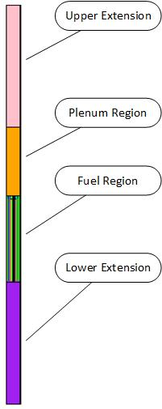
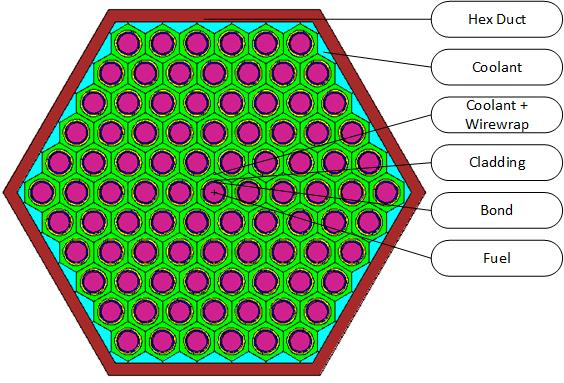

# Summary

Reactor core design for nuclear engineers is an extremely complex topic which requires skills in multiple areas of study.
Often, a core design process starts with examining the neutronic viability.
This process is too complex to be done by hand and requires the use of sophisticated software suites to perform.
Utilizing additional software alleviates solving the fundamental physics associated with core design but comes at the cost of learning the nuances of software suites.
Much of the software used are multi-purpose and not specialized for core design.
Typically each requires building and input deck that incorporates geometry, materials, and the appropriate physics to utilized.
This requires the designer to shift their focus from core design to input file management, which takes away their ability to critically think about core design.
Learning how to create these input files by hand can be frustrating and prone to error.
This is especially the case when trying to model a full heterogeneous core where the input decks can grow exceedingly large (over 10000 lines).
At this size, it is unrealistic to manually adjust values and expect a functioning model free of errors.

FRIDGe was created to help alleviate the process of learning additional code nomenclature when designing, modeling, and testing fast reactors.
The only inputes the user focuses on are directly related to the core design process and create a level of abstraction from the input deck generated.
This allows the user to focus on what aspects of the design affect the reactor, rather than input file creation and management.

FRIDGe currently houses the capability to create input files for single assembly or full core analysis in the code suite MCNP [1].
This process is done by creating a series of YAML data files for elements, materials, assemblies, and cores.
The element file allows the user to create elements from the Chart of the Nuclides for use in materials.
The material file allows the user to create custom materials (fuels, cladding, poisons, etc.) that the model will require.
The assembly file is used for individual assemblies, where the user can specify the assembly type, geometry, and materials used.
The core file is used to determine the assemblies present, their position within the core, and general core data.
The culmination of these data files allows the user to create a single FRIDGe input file.
The input file has control over general setting for the reactor model and any additional features to be applied to the model.
With these files, a user needs to specify what types of assemblies they are making, what materials they are made of, and where they go in the core to create a full fast reactor model.

# Full Assembly Example

To use FRIDGe, an yaml input file is created to reference what assembly will be modeled.
An example was created using the information for an Experimental Breeder Reactor II driver assembly.
For this example, an assembly YAML file was created using the dimensions specified in [2].
Once the model has been created, the user can take the input file and run MCNP to gather any number of reactor physics data available to them.

 

[1] C.J. Werner, et al., "MCNP6.2 Release Notes", Los Alamos National Laboratory, report LA-UR-18-20808 (2018).

[2] E. Lum, C. Pope, R. Stewart, B. Byambadorj,
Q. Beaulieu, “Evaluation of Run 138B at Experimental
Breeder Reactor II”, EBR2-LMFR-RESR-001-CRIT
International Handbook of Evaluated Reactor Physics
Benchmark Experiments, 2018.